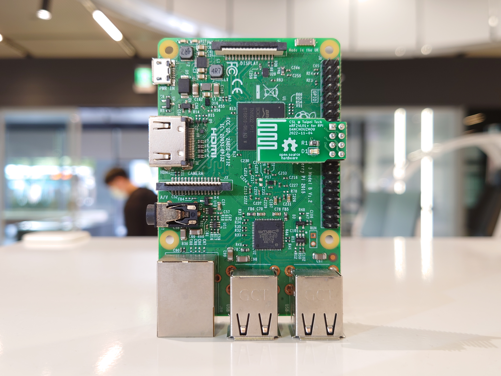

# PiRF
A 2.4G Raspberry Pi nRF24L01 SPI module. [Order the borad on OSH Park!](https://oshpark.com/shared_projects/JfrGd6Lo)

## Fetures
- Support all model of Raspberry Pi (26-pin and 40-pin GPIO)
- On-board LED indicate IRQ of the nRF24
- Fit well with original Raspberry Pi Model B case

## Recommended libraries
RF24 has been tested by our team. Change the CE pin to GPIO24, IRQ to GPIO25 manually.
- [RF24](https://github.com/nRF24/RF24)

## Datasheet
- [GPIO and the 40-pin Header - Raspberry Pi Documentation](https://www.raspberrypi.com/documentation/computers/os.html#gpio-and-the-40-pin-header)
- [nRF24L01P_PS_v1.0.pdf - Nordic Semiconductor](https://infocenter.nordicsemi.com/pdf/nRF24L01P_PS_v1.0.pdf)
- [Ai-thinker NF-03 Specification](https://docs.ai-thinker.com/_media/nf-03_specification_en.pdf)
